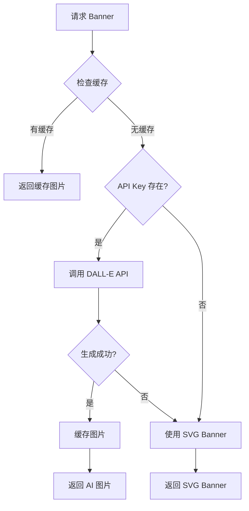

# AI 图片生成方案

## 🎯 方案概述

本方案使用 OpenAI DALL-E API 为博客文章生成专业的 banner 图片，提供比 SVG 更丰富、更吸引人的视觉效果。

## 🚀 快速开始

### 1. 获取 OpenAI API Key

1. 访问 [OpenAI Platform](https://platform.openai.com/)
2. 注册/登录账户
3. 在 API Keys 页面创建新的 API Key
4. 复制 API Key

### 2. 配置环境变量

创建 `.env` 文件：

```bash
# OpenAI API Configuration
OPENAI_API_KEY=your_openai_api_key_here

# Optional: Image Generation Settings
AI_IMAGE_MODEL=dall-e-3
AI_IMAGE_SIZE=1024x1024
AI_IMAGE_QUALITY=standard
AI_IMAGE_STYLE=natural

# Cache Settings
AI_IMAGE_CACHE_ENABLED=true
AI_IMAGE_CACHE_DIR=./public/generated-images
```

### 3. 安装依赖

```bash
npm install
```

### 4. 使用 AI Banner 组件

```astro
---
import AIBlogBanner from '~/components/AIBlogBanner.astro';

const post = {
  title: "AI 重塑营销：从内容生产到精准投放的全链路革命",
  description: "深度解析 AI 如何改变营销的每个环节...",
  category: "AI Marketing",
  tags: ["AI", "Marketing", "Automation"],
  slug: "ai-marketing-revolution"
};
---

<AIBlogBanner 
  post={post} 
  config={{
    width: 600,
    height: 338,
    useAIImage: true  // 启用 AI 图片生成
  }}
/>
```

## 💰 成本分析

### OpenAI DALL-E 定价

- **DALL-E 3**: $0.040 / 1024×1024 图片
- **DALL-E 2**: $0.020 / 1024×1024 图片

### 博客 Banner 成本估算

- **单张图片**: ~$0.01-0.02
- **100 篇文章**: ~$1-2
- **1000 篇文章**: ~$10-20

### 成本优化策略

1. **图片缓存**: 相同文章只生成一次
2. **批量生成**: 减少 API 调用次数
3. **降级方案**: API 失败时使用 SVG banner

## 🛠️ 技术实现

### 核心组件

1. **AIImageGenerator**: AI 图片生成核心类
2. **ImageCache**: 图片缓存管理
3. **AIBlogBanner**: 智能 Banner 组件

### 工作流程



### 提示词模板

系统为不同分类准备了专门的提示词模板：

- **AI Marketing**: 营销图表、数据可视化
- **AI Tools**: 软件工具、生产力图标
- **AI Trends**: 未来技术、创新符号
- **Tech Tutorial**: 学习符号、代码元素

## 🔧 高级配置

### 自定义提示词

```typescript
// 修改 src/config/aiImageConfig.ts
export const promptTemplates = {
  'Custom Category': `Your custom prompt here...`,
};
```

### 调整图片参数

```typescript
// 修改 aiImageConfig
export const aiImageConfig = {
  openai: {
    model: 'dall-e-3',
    size: '1024x1024',
    quality: 'hd',        // 更高质量
    style: 'vivid',       // 更生动风格
  },
};
```

### 缓存管理

```typescript
// 手动清理缓存
const imageCache = new ImageCache();
imageCache.clearCache();
```

## 🚨 注意事项

### API 限制

- **速率限制**: 每分钟最多 20 次请求
- **配额限制**: 每月有使用额度限制
- **内容政策**: 必须遵守 OpenAI 使用政策

### 最佳实践

1. **始终提供降级方案**: API 失败时使用 SVG
2. **实现缓存机制**: 避免重复生成
3. **监控 API 使用**: 控制成本
4. **测试提示词**: 确保生成质量

### 安全考虑

- **API Key 安全**: 不要提交到版本控制
- **内容审核**: 确保生成内容符合政策
- **错误处理**: 优雅处理 API 错误

## 📊 性能对比

| 方案 | 质量 | 成本 | 加载速度 | 个性化 |
|------|------|------|----------|--------|
| SVG Banner | ⭐⭐⭐ | 免费 | 极快 | ⭐⭐ |
| AI Generated | ⭐⭐⭐⭐⭐ | $0.01-0.02/张 | 中等 | ⭐⭐⭐⭐⭐ |

## 🎉 总结

AI 图片生成方案提供了：

- ✅ **更高质量的视觉效果**
- ✅ **完全个性化的设计**
- ✅ **专业的品牌形象**
- ✅ **合理的成本控制**
- ✅ **智能的降级机制**

推荐在预算允许的情况下使用 AI 图片生成，能够显著提升博客的视觉吸引力和专业度。
